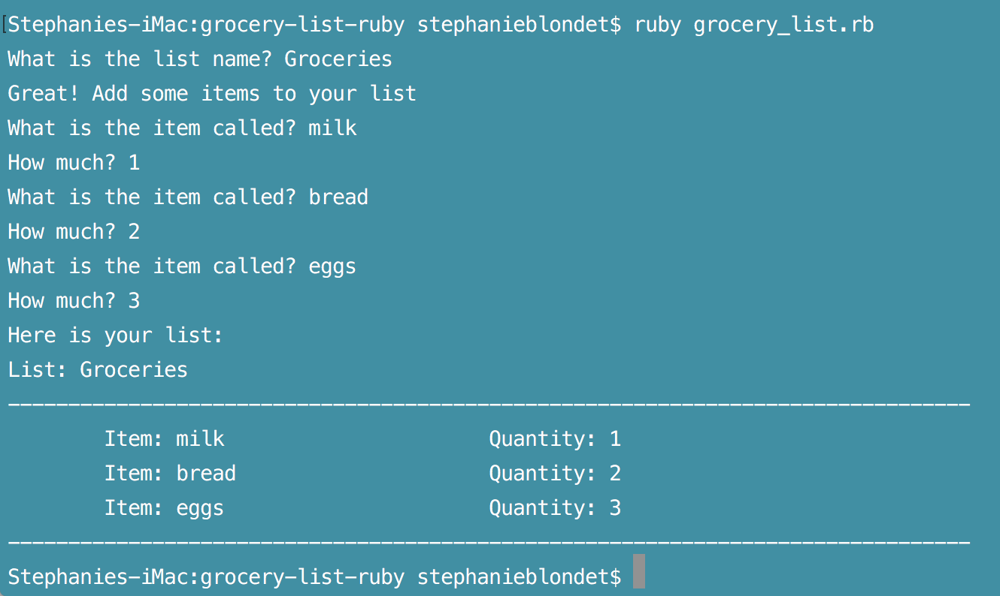

# Grocery List
Grocery list in Ruby using:
- Ruby Strings
- Ruby Numbers
- Ruby Methods
- Ruby Operators
- Ruby Arrays
- Ruby Hashes
- Ruby Collections

---------
*This application was built while taking the 'Learn Ruby' track at Treehouse. January, 2017.
